---
# Front matter
title: "Отчёт по лабораторной работе 1"
subtitle: "Установка и конфигурация операционной системы на виртуальную машину"
author: "Максимова Ксения НБИбд-02-18"

# Generic otions
lang: ru-RU
toc-title: "Содержание"

# Bibliography
bibliography: bib/cite.bib
csl: pandoc/csl/gost-r-7-0-5-2008-numeric.csl

# Pdf output format
toc: true # Table of contents
toc_depth: 2
lof: true # List of figures
fontsize: 12pt
linestretch: 1.5
papersize: a4
documentclass: scrreprt
## I18n
polyglossia-lang:
  name: russian
  options:
	- spelling=modern
	- babelshorthands=true
polyglossia-otherlangs:
  name: english
### Fonts
mainfont: PT Serif
romanfont: PT Serif
sansfont: PT Sans
monofont: PT Mono
mainfontoptions: Ligatures=TeX
romanfontoptions: Ligatures=TeX
sansfontoptions: Ligatures=TeX,Scale=MatchLowercase
monofontoptions: Scale=MatchLowercase,Scale=0.9
## Biblatex
biblatex: true
biblio-style: "gost-numeric"
biblatexoptions:
  - parentracker=true
  - backend=biber
  - hyperref=auto
  - language=auto
  - autolang=other*
  - citestyle=gost-numeric
## Misc options
indent: true
header-includes:
  - \linepenalty=10 # the penalty added to the badness of each line within a paragraph (no associated penalty node) Increasing the value makes tex try to have fewer lines in the paragraph.
  - \interlinepenalty=0 # value of the penalty (node) added after each line of a paragraph.
  - \hyphenpenalty=50 # the penalty for line breaking at an automatically inserted hyphen
  - \exhyphenpenalty=50 # the penalty for line breaking at an explicit hyphen
  - \binoppenalty=700 # the penalty for breaking a line at a binary operator
  - \relpenalty=500 # the penalty for breaking a line at a relation
  - \clubpenalty=150 # extra penalty for breaking after first line of a paragraph
  - \widowpenalty=150 # extra penalty for breaking before last line of a paragraph
  - \displaywidowpenalty=50 # extra penalty for breaking before last line before a display math
  - \brokenpenalty=100 # extra penalty for page breaking after a hyphenated line
  - \predisplaypenalty=10000 # penalty for breaking before a display
  - \postdisplaypenalty=0 # penalty for breaking after a display
  - \floatingpenalty = 20000 # penalty for splitting an insertion (can only be split footnote in standard LaTeX)
  - \raggedbottom # or \flushbottom
  - \usepackage{float} # keep figures where there are in the text
  - \floatplacement{figure}{H} # keep figures where there are in the text
---

# Цель работы

Приобретение практических навыков установки операционной системы на виртуальную машину, настройки минимально необходимых для
дальнейшей работы сервисов.

# Задание

Установить операционную систему на виртуальную машину и задать минимально необходимые настройки для дальнейшей работы сервисов

# Теоретическое введение

Oracle VM VirtualBox, самое популярное в мире кросс-платформенное программное обеспечение для виртуализации с открытым исходным кодом, 
позволяет разработчикам быстрее доставлять код за счет запуска нескольких операционных систем на одном устройстве.[[1]](https://www.oracle.com/ru/virtualization/virtualbox/)

Основные возможности Oracle VM VirtualBox:

1. Упрощает операции
2. Автоматизирует развертывание в облаке
3. Ускоряет отслеживание контроля качества, тестирования и демонстраций
4. Обеспечивает безопасный доступ к приложениям для удаленных сотрудников
5. Является лицензированным продуктом и осуществляется поддержка пользователей 

Основной целью использования виртуальной машины является необходимость поддержки нескольких ОС и версий на одном устройстве. Например, Windows и Linux, или разные дистрибутивы одной операционной системы.
Самыми распространенными дистрибутивами Linux являются[[2]](https://www.linux.org/pages/download/):

 - Linux Mint
 - Ubuntu
 - Debian
 - Mageia
 - Fedora
 - OpenSUSE
 - ArchLinux
 - CentOS
 - PCLinuxOS
 - Slackware
 - Gentoo.
 
 Рассмотрим подробнее такой дистрибутив, как CentOS
 
 CentOS - это стабильная, управляемая и воспроизводимая платформа, основанная на источниках Red Hat Enterprise Linux (RHEL)[[3]](https://www.centos.org/about/).
 
 CentOS Linux разрабатывается небольшой, но растущей командой основных разработчиков. 
 В свою очередь, основные разработчики поддерживаются активным сообществом пользователей, включая системных администраторов, 
 сетевых администраторов, менеджеров и поклонников Linux со всего мира. 
 На данный момент наиболее популярными версиями CentOS являются 7 и 8.

# Выполнение лабораторной работы

Перед началом выполнения лабораторной работы я скачала виртуальную машину VirtualBox.

Далее, через терминал я создала папки var, tmp и kamksimova 

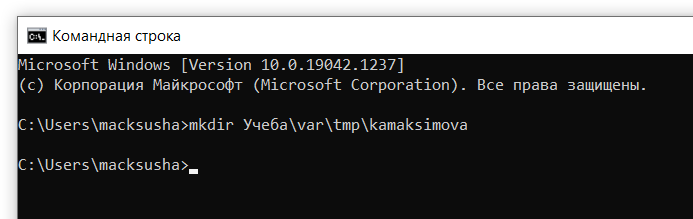{ #fig:001 width=70% }

[Рисунок 1](image/Pic1.png)

После этого я скопировала заранее скачанный образ виртуальной машины CentOs в папку kamksimova 

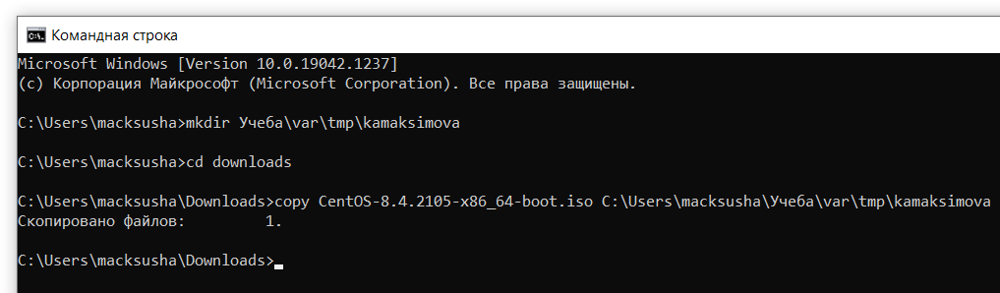{ #fig:002 width=70% }

[Рисунок 2](image/Pic2.png)

Проверим, что все созданные виртуальные машины будут хранится в созданной папке 

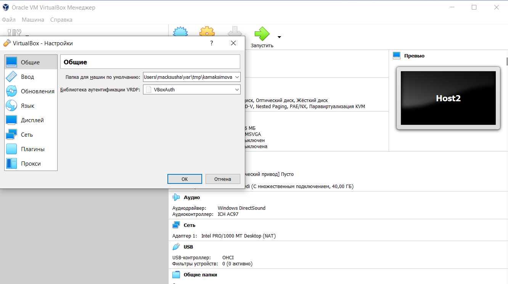{ #fig:003 width=70% }

[Рисунок 3](image/Pic3.png)

Для создания новой виртуальной машины я перешла в VirtualBox и выбрала Машина, создать. Указала имя новой виртуальной машины — Base, тип операционной системы
— Linux, RedHat. Далее перешла к заданию основных настроек. 

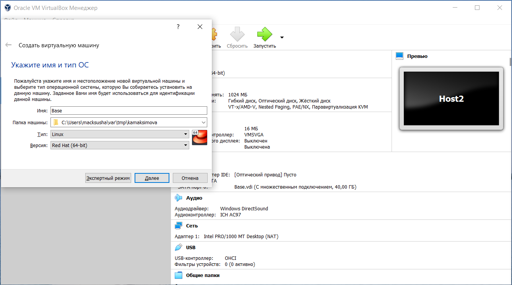{ #fig:004 width=70% }

[Рисунок 4](image/Pic4.png)

Размер основной памяти - 1024 МБ.
Конфигурацию жёсткого диска — загрузочный, VDI (BirtualBoxDisk Image), динамический виртуальный диск
Размер диска — 40 ГБ, его расположение — "/var/tmp/kamaksimova/Base/Base.vdi"

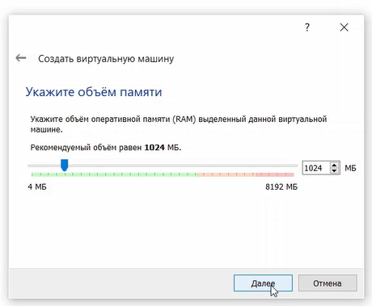{ #fig:005 widt=70% } 

[Рисунок 5](image/Pic5.png)

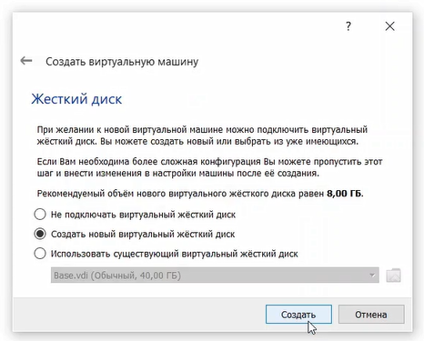{ #fig:006 widt=70% }

[Рисунок 6](image/Pic6.png)

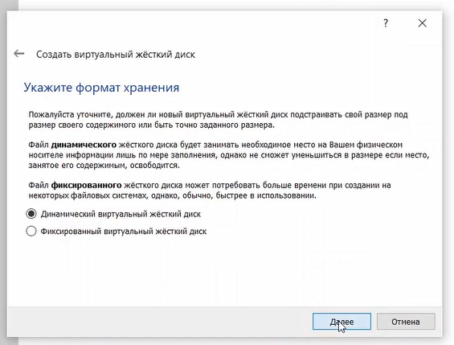{ #fig:007 widt=70% }

[Рисунок 7](image/Pic7.png)

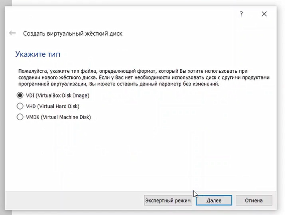{ #fig:008 widt=70% }

[Рисунок 8](image/Pic8.png)

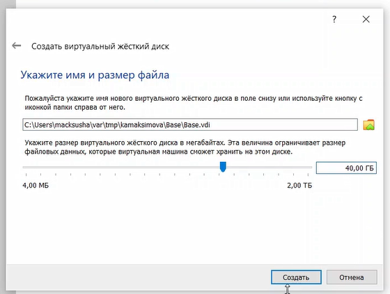{ #fig:009 widt=70% }

[Рисунок 9](image/Pic9.png)

Основные параметры заданы, теперь необходимо проверить, что все снимки виртуальной машины будут хранится в папке "/var/tmp/kamaksimova/Base/Snapshots"
Для этого в свойствах виртуальной машины заходим во вкладку общие, затем дополнительно.

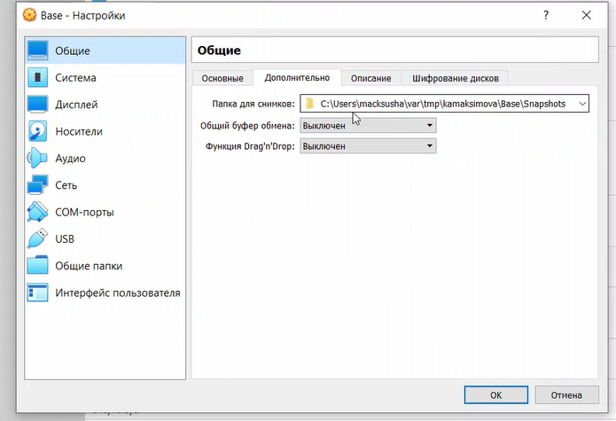{ #fig:010 widt=70% }

[Рисунок 10](image/Pic10.png)

После этого необходимо добавить новый привод оптических дисков и выбрать тот образ, который мы скачивали ранее

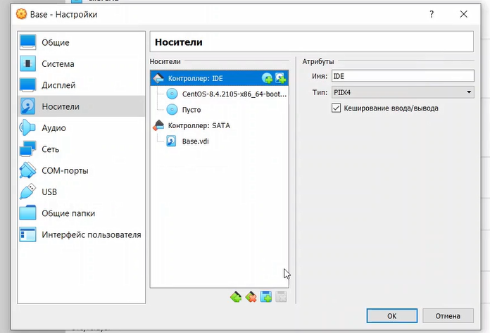{ #fig:011 widt=70% }

[Рисунок 11](image/Pic11.png)

После этого можно приступить к запуску виртуальной машины

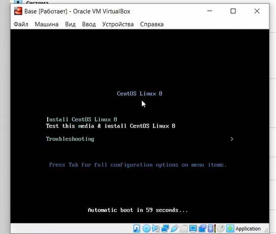{ #fig:012 widt=70% }

[Рисунок 12](image/Pic12.png)

В первую очередь, после запуска выбираем язык установки 

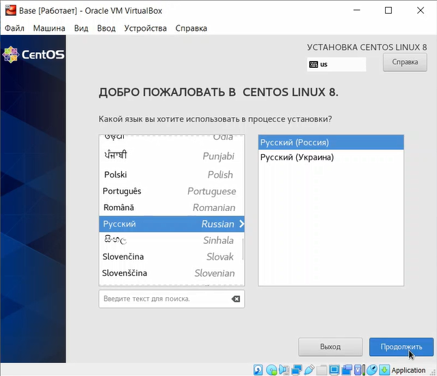{ #fig:013 widt=70% }

[Рисунок 13](image/Pic13.png)

Далее система предлагает настроить некоторые параметры системы перед дальнейшей установкой

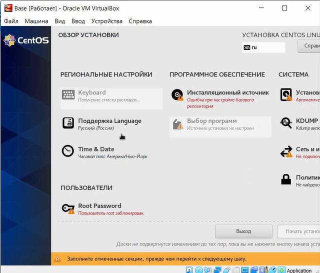{ #fig:014 widt=70% }

[Рисунок 14](image/Pic14.png)

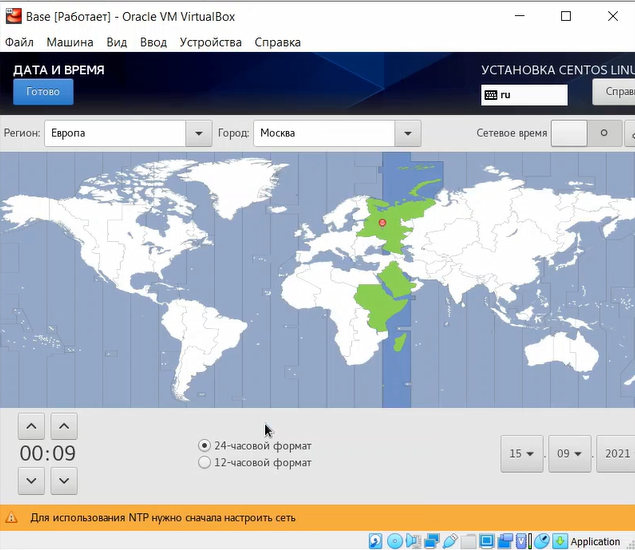{ #fig:015 widt=70% }

[Рисунок 15](image/Pic15.png)

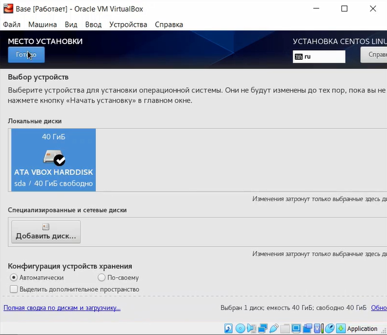{ #fig:016 widt=70% }

[Рисунок 16](image/Pic16.png)

В качестве имени узла указываем kamaksimova.localdomain

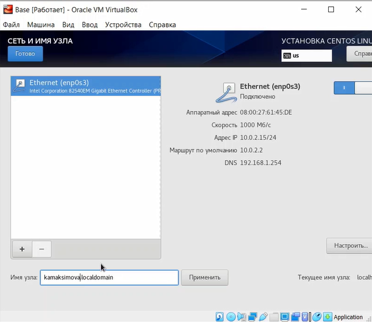{ #fig:017 widt=70% }

[Рисунок 17](image/Pic17.png)

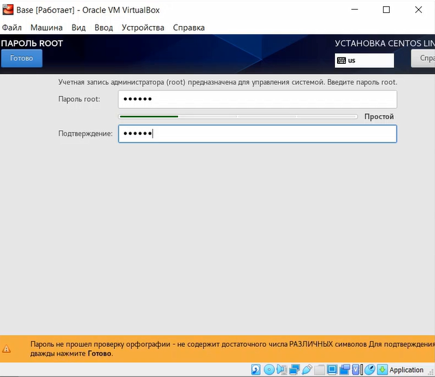{ #fig:018 widt=70% }

[Рисунок 1](image/Pic18.png)

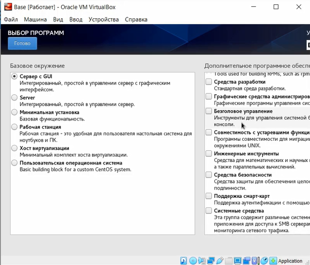{ #fig:019 widt=70% }

[Рисунок 19](image/Pic19.png)

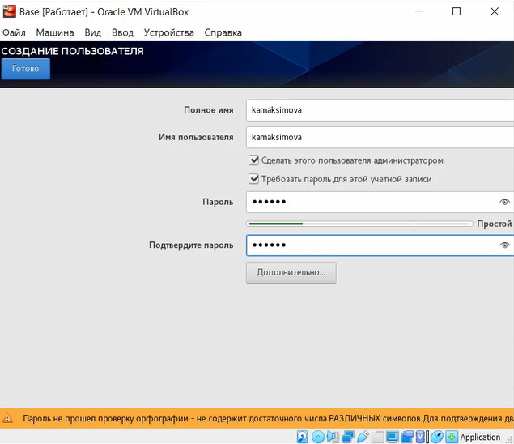{ #fig:020 widt=70% }

[Рисунок 20](image/Pic20.png)

После настройки продолжаем установку 

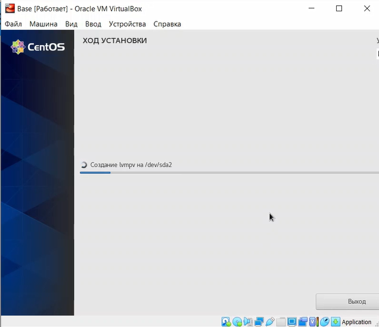{ #fig:021 widt=70% }

[Рисунок 21](image/Pic21.png)

Подключаюсь к виртуальной машине с помощью созданной учетной записи

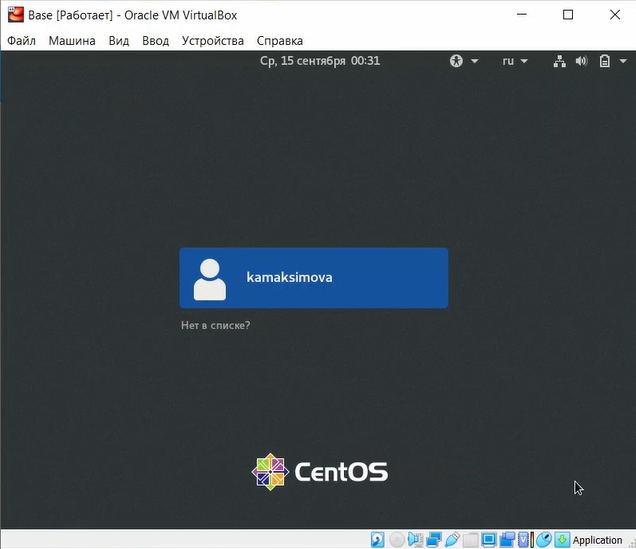{ #fig:022 widt=70% }

[Рисунок 22](image/Pic22.png)

После установки запускаю терминал на виртуальной машине и с помощью команды su перехожу в корневой каталог

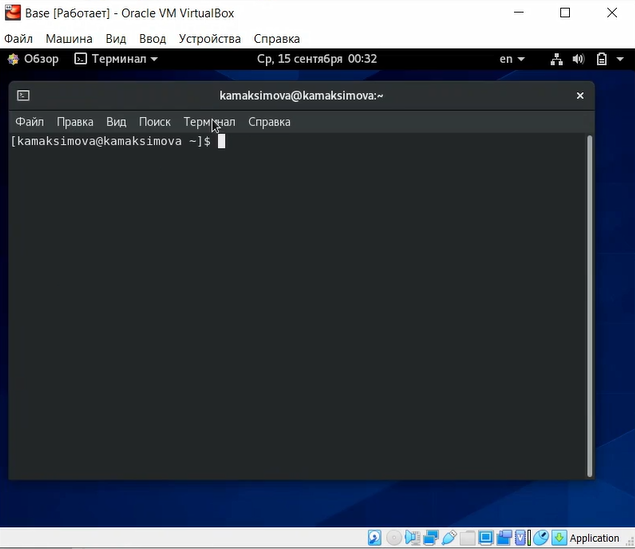{ #fig:023 widt=70% }

[Рисунок 23](image/Pic23.png)

Устанавливаю необходимые программы

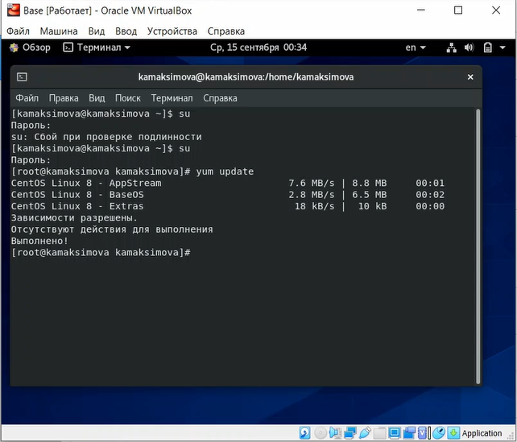{ #fig:024 widt=70% }

[Рисунок 24](image/Pic24.png)

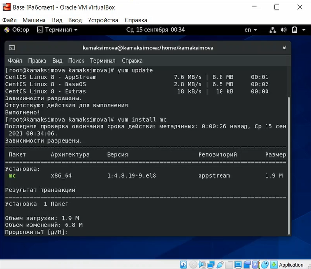{ #fig:025 widt=70% }

[Рисунок 25](image/Pic25.png)

После этого завершаем работу виртуальной машины и переходим в менеджер виртуальных носителей, где изменяем свойства жесткого диска, а именно указываем тип - с множественным подключением и освобождаем его.

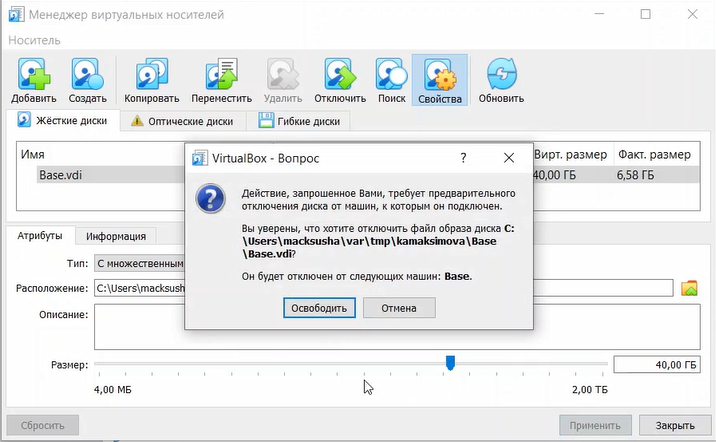{ #fig:026 widt=70% }

[Рисунок 26](image/Pic26.png)
 
Теперь на основе виртуальной машины Base можно создать машину Host2.Выбираю в VirtualBox Машина Создать и в «Мастере создания новой
виртуальной машины» указав в качестве имени машины Host2, в качестве типа операционной системы — Linux, версия «RedHat», а при конфигурации виртуального жёсткого диска выбрав «Использовать существующий
жёсткий диск» Base.vdi.

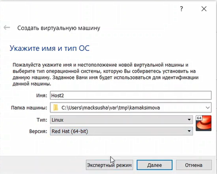{ #fig:027 widt=70% }

[Рисунок 27](image/Pic27.png)

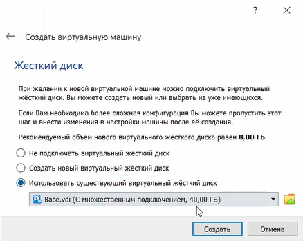{ #fig:028 widt=70% }

[Рисунок 28](image/Pic29.png)

# Выводы

В ходе лабораторной работы я приобрела практические навыки установки операционной системы на виртуальную машину, а также настройки минимально необходимых для
дальнейшей работы сервисов.

# Список литературы{.unnumbered}
[1. Oracle VM VirtualBox](https://www.oracle.com/ru/virtualization/virtualbox/)

[2. Download Linux](https://www.linux.org/pages/download/)

[3. About CentOS](https://www.centos.org/about/)

::: {#refs}
:::
