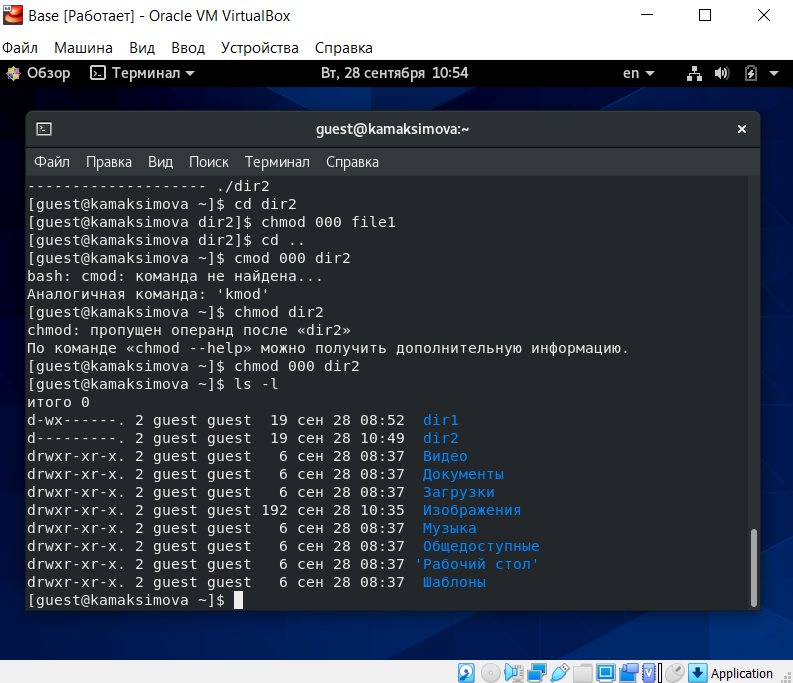

---
# Front matter
title: "Отчёт по лабораторной работе 2"
subtitle: "Дискреционное разграничение прав в Linux. Основные атрибуты"
author: "Максимова Ксения НБИбд-02-18"

# Generic otions
lang: ru-RU
toc-title: "Содержание"

# Bibliography
bibliography: bib/cite.bib
csl: pandoc/csl/gost-r-7-0-5-2008-numeric.csl

# Pdf output format
toc: true # Table of contents
toc_depth: 2
lof: true # List of figures
fontsize: 12pt
linestretch: 1.5
papersize: a4
documentclass: scrreprt
## I18n
polyglossia-lang:
  name: russian
  options:
	- spelling=modern
	- babelshorthands=true
polyglossia-otherlangs:
  name: english
### Fonts
mainfont: PT Serif
romanfont: PT Serif
sansfont: PT Sans
monofont: PT Mono
mainfontoptions: Ligatures=TeX
romanfontoptions: Ligatures=TeX
sansfontoptions: Ligatures=TeX,Scale=MatchLowercase
monofontoptions: Scale=MatchLowercase,Scale=0.9
## Biblatex
biblatex: true
biblio-style: "gost-numeric"
biblatexoptions:
  - parentracker=true
  - backend=biber
  - hyperref=auto
  - language=auto
  - autolang=other*
  - citestyle=gost-numeric
## Misc options
indent: true
header-includes:
  - \linepenalty=10 # the penalty added to the badness of each line within a paragraph (no associated penalty node) Increasing the value makes tex try to have fewer lines in the paragraph.
  - \interlinepenalty=0 # value of the penalty (node) added after each line of a paragraph.
  - \hyphenpenalty=50 # the penalty for line breaking at an automatically inserted hyphen
  - \exhyphenpenalty=50 # the penalty for line breaking at an explicit hyphen
  - \binoppenalty=700 # the penalty for breaking a line at a binary operator
  - \relpenalty=500 # the penalty for breaking a line at a relation
  - \clubpenalty=150 # extra penalty for breaking after first line of a paragraph
  - \widowpenalty=150 # extra penalty for breaking before last line of a paragraph
  - \displaywidowpenalty=50 # extra penalty for breaking before last line before a display math
  - \brokenpenalty=100 # extra penalty for page breaking after a hyphenated line
  - \predisplaypenalty=10000 # penalty for breaking before a display
  - \postdisplaypenalty=0 # penalty for breaking after a display
  - \floatingpenalty = 20000 # penalty for splitting an insertion (can only be split footnote in standard LaTeX)
  - \raggedbottom # or \flushbottom
  - \usepackage{float} # keep figures where there are in the text
  - \floatplacement{figure}{H} # keep figures where there are in the text
---

# Цель работы

Получение практических навыков работы в консоли с атрибутами файлов, закрепление теоретических основ дискреционного разграничения доступа 
в современных системах с открытым кодом на базе ОС Linux

# Задание

Создать нового пользователя в ранее установленной оперционной системе на виртуальной машине, определить установленные права, 
разрешенные действия и минимальные права для совершения оперций 

# Теоретическое введение

В операционной системе Linux есть много отличных функций безопасности, 
но она из самых важных - это система прав доступа к файлам. 
Linux в отличие от Windows, изначально проектировался как многопользовательская система, 
поэтому права доступа к файлам в linux продуманы очень хорошо [[1]](https://losst.ru/prava-dostupa-k-fajlam-v-linux) .

Права доступа к файду или директории можно изменить с помощью команды chmod.
Атрибуты файла или каталога можно указать как буквами так и цифрами. Установить необходимые атрибуты можно для 
владельца файла (u), группы (g) или остальных пользователей (o) [[1]](https://losst.ru/prava-dostupa-k-fajlam-v-linux).

Права достуа к какому-либо объекту в системе обозначаются с помощью 10 символов,
записанных в строчку [[2]](https://linuxrussia.com/terminal-chmod-chown.html).
1.Первый символ в строке обозначает тип данных
2.Следующие три символа обозначают права для владельца файла или директории
3.После - права для определенной группы пользователей 
4.Последние четыре символа - права для остальных пользователей

Рассмотрим, какими правами может быть наделен файл или директория:

- r - read, то есть, право доступа на чтение файла или директории.
- w - write, то есть, право на изменение и удаление файла или директории.
- x	- eXecute, то есть, право на запуск файла как программы или вход в директорию.

Таким образом, можно ограничить или расширить права на файл тех или иных пользователей

# Выполнение лабораторной работы

Через терминал от имени администратора создаем нового пользователя guest с помощью команды useradd  

{ #fig:001 width=70% }

[Рисунок 1](image/Pic1.png)

После этого я установила для нового пользователя пароль с помощью команды passwd  

{ #fig:002 width=70% }

[Рисунок 2](image/Pic2.png)

Заходим в систему от имени нового пользователя  

{ #fig:003 width=70% }

[Рисунок 3](image/Pic3.png)

С помощью команды pwd уточнили директорию, что находимся в директории "/home/guest". Это домашняя директория

{ #fig:004 width=70% }

[Рисунок 4](image/Pic4.png)

С помощью команды whoami уточним имя пользователя. Имя пользователя: guest

{ #fig:005 widt=70% } 

[Рисунок 5](image/Pic5.png)

Определили имя пользователя, его группу, а также группы, куда входит пользователь, командой id.
Зафиксируем значения uid: "1001", gid = "1001", группы = "1001(guest)

{ #fig:006 widt=70% } 

[Рисунок 6](image/Pic6.png)

Команда groups поддтвердила, что пользователь guest входит только в группу guest

{ #fig:007 widt=70% } 

[Рисунок 7](image/Pic7.png)

Посмотрели файлы командой cat "/etc/passwd" и нашли учетную запись пользователя guest 

{ #fig:008 widt=70% } 

[Рисунок 8](image/Pic8.png)

Определили существующие в системе директории с помощью команды ls -l "/home/"

{ #fig:009 widt=70% } 

[Рисунок 9](image/Pic9.png)

Проверим, установлены ли какие-либо расширенные атрибуты на поддиректориях
Нам не удалось посмотреть расширенный атрибуты ни своих директорий, ни директорий других пользователей

{ #fig:0010 widt=70% } 

[Рисунок 10](image/Pic10.png)

Создаем в домашней директории поддиректорию dir2

{ #fig:0011 widt=70% } 

[Рисунок 11](image/Pic11.png)

Так же создаем в директории dir2 файл с именем file1. 

{ #fig:0012 widt=70% } 

[Рисунок 12](image/Pic12.png)

Проверяем права на директорию. Для пользователя установлены права на запись и запуск

{ #fig:0013 widt=70% } 

[Рисунок 13](image/Pic13.png)

Сначала с файла, а затем и с директории снимаем все права. С помощью команды 
ls -l проверяем правильность выполнения команды 

{ #fig:0014 widt=70% } 

[Рисунок 14](image/Pic14.png)

Попытались создать в директории dir2 файл file1 командой
echo "test" > "/home/guest/dir1/file1. Получили отказ, так как мы сами сняли все атрибуты прав на директорию

{ #fig:0015 widt=70% } 

[Рисунок 15](image/Pic15.png)

Для заполнения таблицы "Установленные права и разрешенные действия" необходимо последовательно
для каждой вариации прав на директорию и файл использовать 9 команд. 
А именно:

Команду  touch для создания файла 

{ #fig:0017 widt=70% } 

[Рисунок 17](image/Pic17.png)

Команду rm для удаления 

{ #fig:0018 widt=70% } 

[Рисунок 18](image/Pic18.png)

Команду echo для записи в файл

{ #fig:0019 widt=70% } 

[Рисунок 19](image/Pic19.png)

Команду cat для чтения файда

{ #fig:0020 widt=70% } 

[Рисунок 20](image/Pic20.png)
 
Команду cd для смены директории 

{ #fig:0021 widt=70% } 

[Рисунок 21](image/Pic21.png)

Команду ls для просмотра файлов в директории

Команду mv для переименования файла 

Смена атрибутов файла - chmod

{ #fig:0022 widt=70% } 

[Рисунок 22](image/Pic22.png)

В итоге получается следующая таблица с 64 строками 

{ #fig:0023 widt=70% } 

[Рисунок 23](image/Pic23.png)

На основе этой таблицы мы можем заполнить таблицу "Минимальные права для совершения операций"

{ #fig:0024 widt=70% } 

[Рисунок 24](image/Pic24.png) 

# Выводы

В ходе лабораторной работы были установлены разрешенные действия для файла и
директории для всех вариаций прав (для первой группы), а так же были установлены минимально необходимые права для совершения тех или иных действий.

# Список литературы{.unnumbered}
[1. Права доступа к файлам в Linux](https://losst.ru/prava-dostupa-k-fajlam-v-linux)

[2. Терминал Linux](https://linuxrussia.com/terminal-chmod-chown.html)

::: {#refs}
:::
