---
# Front matter
title: "Отчёт по лабораторной работе 3"
subtitle: "Дискреционное разграничение прав в Linux. Два пользователя"
author: "Максимова Ксения НБИбд-02-18"

# Generic otions
lang: ru-RU
toc-title: "Содержание"

# Bibliography
bibliography: bib/cite.bib
csl: pandoc/csl/gost-r-7-0-5-2008-numeric.csl

# Pdf output format
toc: true # Table of contents
toc_depth: 2
lof: true # List of figures
fontsize: 12pt
linestretch: 1.5
papersize: a4
documentclass: scrreprt
## I18n
polyglossia-lang:
  name: russian
  options:
	- spelling=modern
	- babelshorthands=true
polyglossia-otherlangs:
  name: english
### Fonts
mainfont: PT Serif
romanfont: PT Serif
sansfont: PT Sans
monofont: PT Mono
mainfontoptions: Ligatures=TeX
romanfontoptions: Ligatures=TeX
sansfontoptions: Ligatures=TeX,Scale=MatchLowercase
monofontoptions: Scale=MatchLowercase,Scale=0.9
## Biblatex
biblatex: true
biblio-style: "gost-numeric"
biblatexoptions:
  - parentracker=true
  - backend=biber
  - hyperref=auto
  - language=auto
  - autolang=other*
  - citestyle=gost-numeric
## Misc options
indent: true
header-includes:
  - \linepenalty=10 # the penalty added to the badness of each line within a paragraph (no associated penalty node) Increasing the value makes tex try to have fewer lines in the paragraph.
  - \interlinepenalty=0 # value of the penalty (node) added after each line of a paragraph.
  - \hyphenpenalty=50 # the penalty for line breaking at an automatically inserted hyphen
  - \exhyphenpenalty=50 # the penalty for line breaking at an explicit hyphen
  - \binoppenalty=700 # the penalty for breaking a line at a binary operator
  - \relpenalty=500 # the penalty for breaking a line at a relation
  - \clubpenalty=150 # extra penalty for breaking after first line of a paragraph
  - \widowpenalty=150 # extra penalty for breaking before last line of a paragraph
  - \displaywidowpenalty=50 # extra penalty for breaking before last line before a display math
  - \brokenpenalty=100 # extra penalty for page breaking after a hyphenated line
  - \predisplaypenalty=10000 # penalty for breaking before a display
  - \postdisplaypenalty=0 # penalty for breaking after a display
  - \floatingpenalty = 20000 # penalty for splitting an insertion (can only be split footnote in standard LaTeX)
  - \raggedbottom # or \flushbottom
  - \usepackage{float} # keep figures where there are in the text
  - \floatplacement{figure}{H} # keep figures where there are in the text
---

# Цель работы

Получение практических навыков работы в консоли с атрибутами файлов для групп пользователей.

# Задание

Создать двух пользователей в ранее установленной оперционной системе на виртуальной машине, определить установленные права, 
разрешенные действия и минимальные права для совершения оперций 

# Теоретическое введение

В операционной системе Linux есть много отличных функций безопасности, 
но она из самых важных - это система прав доступа к файлам. 
Linux в отличие от Windows, изначально проектировался как многопользовательская система, 
поэтому права доступа к файлам в linux продуманы очень хорошо [[1]](https://losst.ru/prava-dostupa-k-fajlam-v-linux) .

Права доступа к файду или директории можно изменить с помощью команды chmod.
Атрибуты файла или каталога можно указать как буквами так и цифрами. Установить необходимые атрибуты можно для 
владельца файла (u), группы (g) или остальных пользователей (o) [[1]](https://losst.ru/prava-dostupa-k-fajlam-v-linux).

Права достуа к какому-либо объекту в системе обозначаются с помощью 10 символов,
записанных в строчку [[2]](https://linuxrussia.com/terminal-chmod-chown.html).

1. Первый символ в строке обозначает тип данных
2. Следующие три символа обозначают права для владельца файла или директории
3. После - права для определенной группы пользователей 
4. Последние четыре символа - права для остальных пользователей

Рассмотрим, какими правами может быть наделен файл или директория:

- r - read, то есть, право доступа на чтение файла или директории.
- w - write, то есть, право на изменение и удаление файла или директории.
- x	- eXecute, то есть, право на запуск файла как программы или вход в директорию.

Таким образом, можно ограничить или расширить права на файл тех или иных пользователей

Права доступа для пользователей группы определяются второй триадой символов в строчке прав, как и любой другой пользователь или владелец,
пользователь группы может получить права на чтение, изменение или удаление, а так же запуск файла [[3]](https://moodle.kstu.ru/pluginfile.php/318215/mod_resource/content/1/Теория_разграничение_прав_пользователи.pdf)

# Выполнение лабораторной работы

В установленной операционной системе создаем учётную запись пользователя guest с помощью команды useradd  

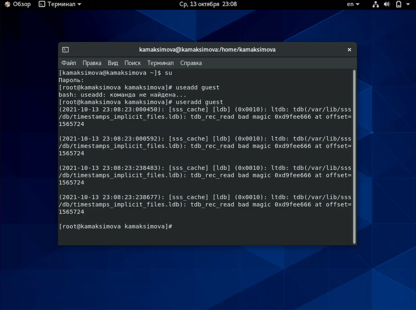{ #fig:001 width=70% }

[Рисунок 1](image/Pic1.png)

Задаем пароль для пользователя guest с помощью команды passwd  

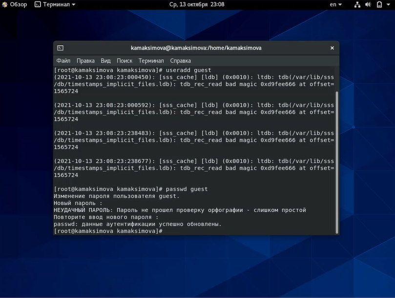{ #fig:002 width=70% }

[Рисунок 2](image/Pic2.png)

Аналогично создаем второго пользователя guest2 

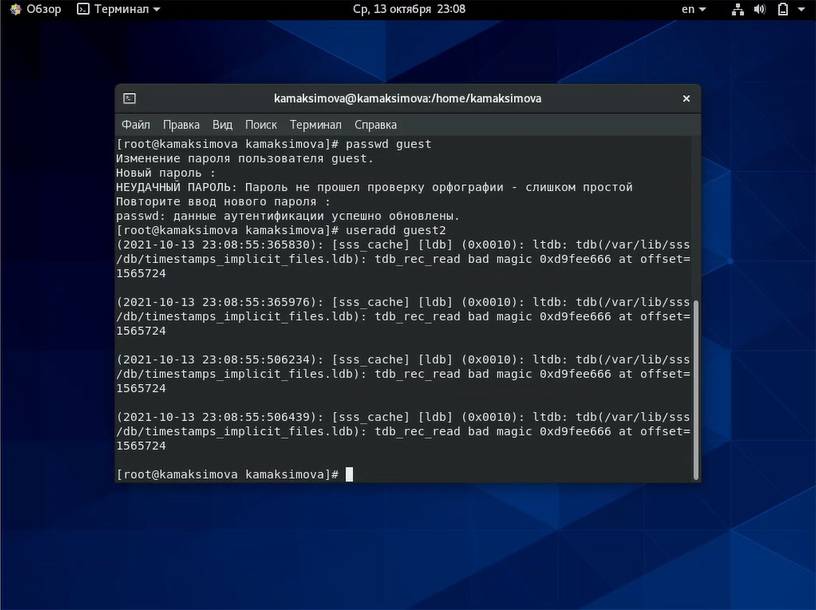{ #fig:003 width=70% }

[Рисунок 3](image/3.png)
 
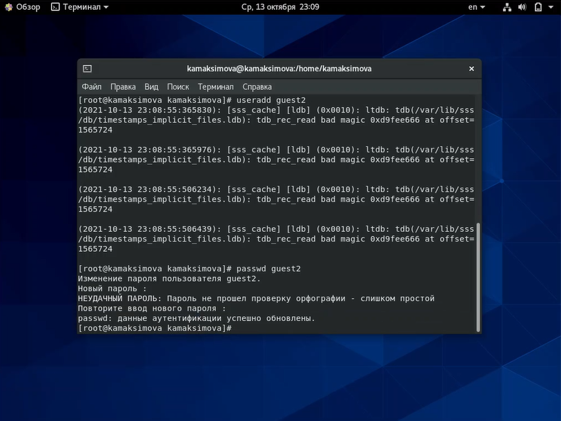{ #fig:004 width=70% }

[Рисунок 4](image/4.png)

Добавляем пользователя guest2 в группу guest

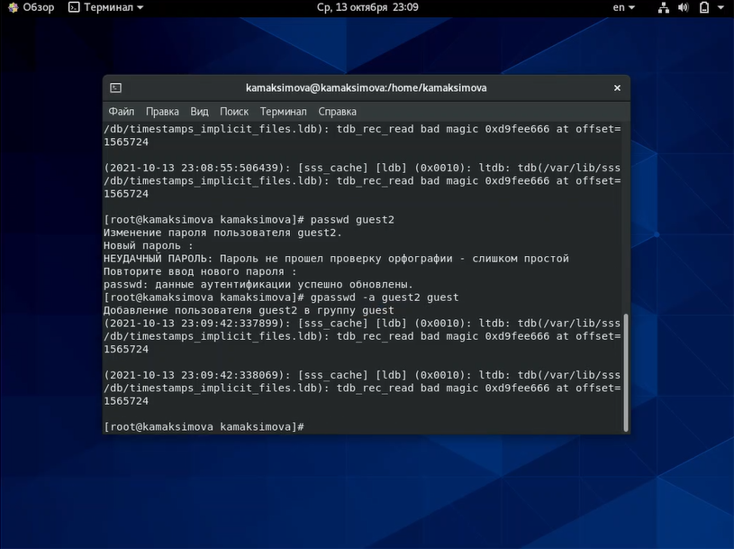{ #fig:005 width=70% }

[Рисунок 5](image/5.png)

Осуществляем вход в систему от двух пользователей на двух разных консолях: guest на первой консоли и guest2 на второй консоли

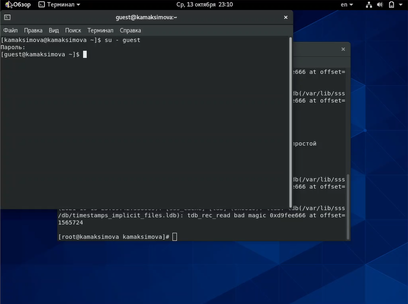{ #fig:006 width=70% }

[Рисунок 6](image/6.png)

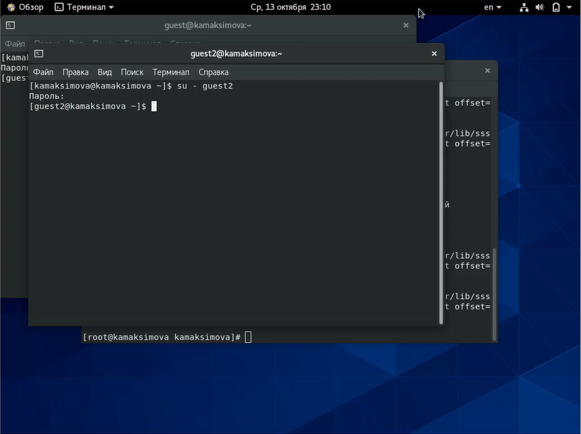{ #fig:007 width=70% }

[Рисунок 7](image/7.png)

Для обоих пользователей командой pwd определяем директорию, в которой находимся

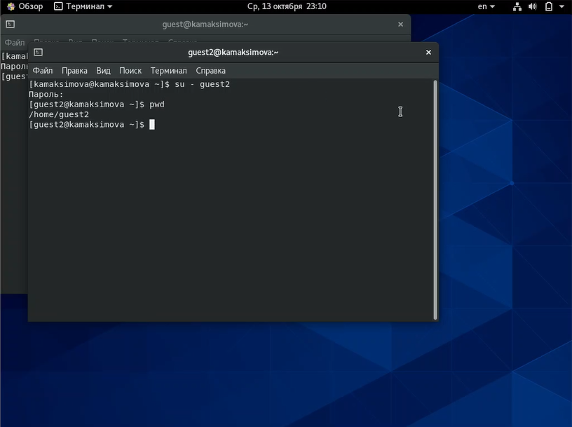{ #fig:008 width=70% }

[Рисунок 8](image/8.png)

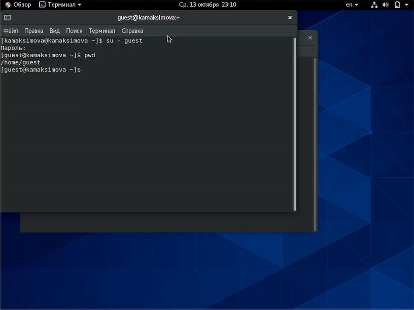{ #fig:009 width=70% }

[Рисунок 9](image/9.png)

Уточним имя пользователя, его группу, кто входит в неё и к каким группам принадлежит пользователь. 
Определим командами groups guest и groups guest2, в какие группы входят пользователи guest и guest2.

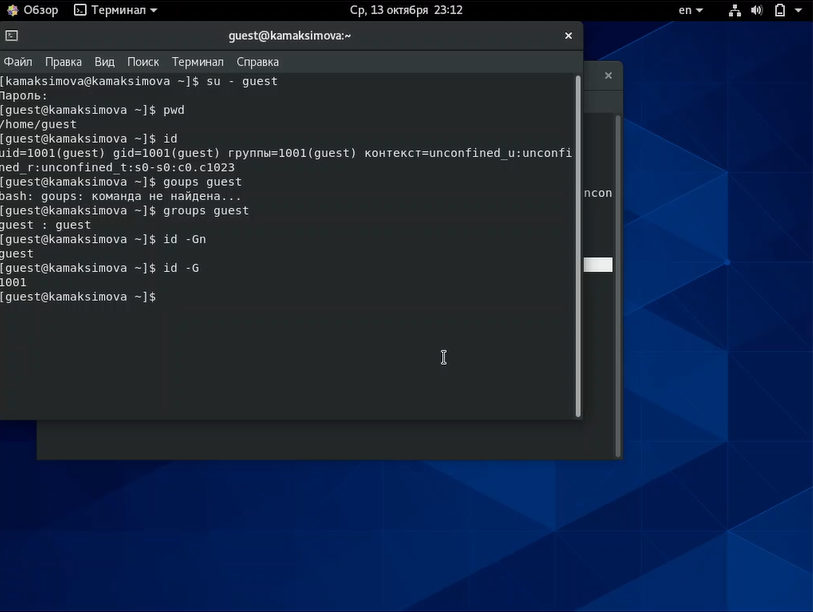{ #fig:010 width=70% }

[Рисунок 10](image/10.png)

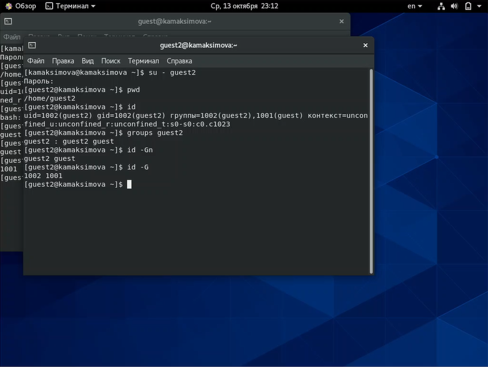{ #fig:011 width=70% }

[Рисунок 11](image/11.png)

Просмотрим файл "/etc/group" командой cat

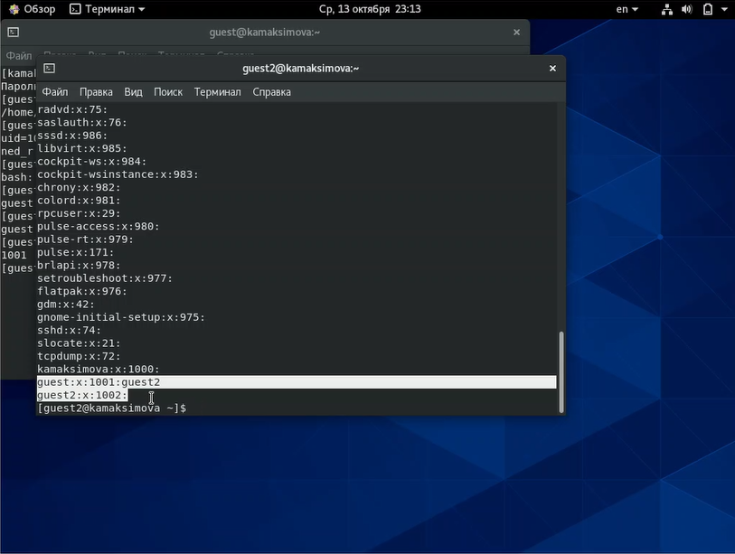{ #fig:012 width=70% }

[Рисунок 12](image/12.png)

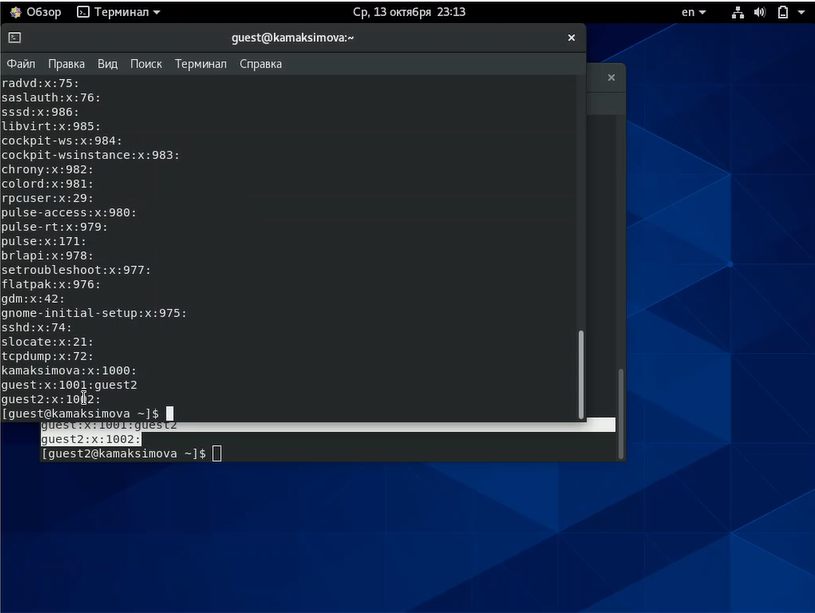{ #fig:013 width=70% }

[Рисунок 13](image/13.png)

От имени пользователя guest2 выполним регистрацию пользователя guest2 в группе guest

{ #fig:014 width=70% }

[Рисунок 14](image/14.png)

От имени пользователя guest изменим права директории "/home/guest",разрешив все действия для пользователей группы

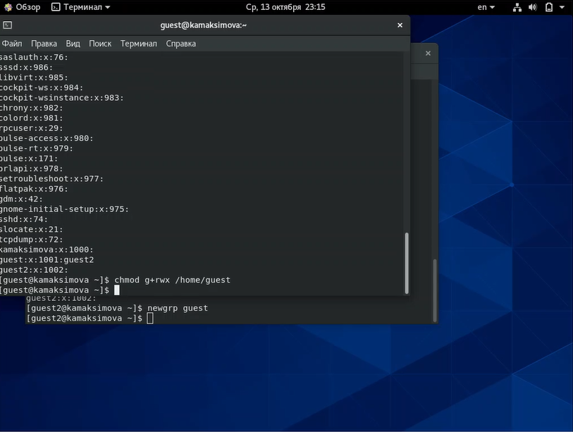{ #fig:015 width=70% }

[Рисунок 15](image/15.png)

От имени пользователя guest снимаем с директории "/home/guest/dir1" все атрибуты 

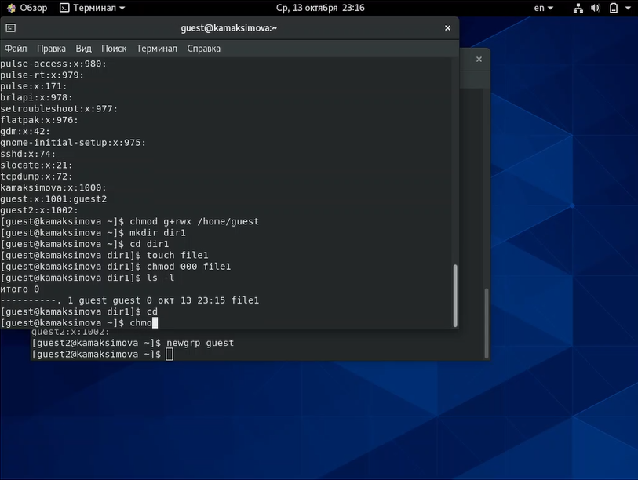{ #fig:016 width=70% }

[Рисунок 16](image/16.png)

Меняя атрибуты у директории dir1 и файла file1 от имени пользователя guest и делая проверку от пользователя guest2, заполнила таблицу 
"Разрешенные права и действия для пользователей групп"
определив опытным путём, какие операции разрешены, а какие нет.

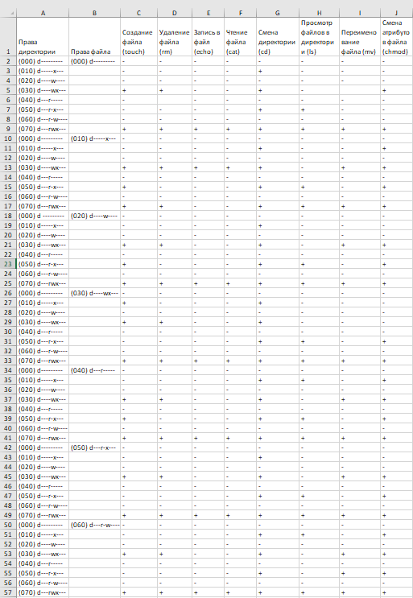{ #fig:017 width=70% }

[Рисунок 17](image/17.png)
 
На основании заполненной таблицы определила те или иные минимально необходимые права для выполнения пользователем guest2 операций
внутри директории dir1

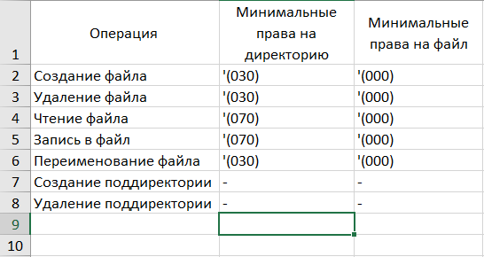{ #fig:018 width=70% }

[Рисунок 18](image/18.png)

# Выводы

В ходе лабораторной работы были установлены разрешенные действия для файла и
директории для пользователей групп, а так же были установлены минимально необходимые права для совершения тех или иных действий.

# Список литературы{.unnumbered}
[1. Права доступа к файлам в Linux](https://losst.ru/prava-dostupa-k-fajlam-v-linux)

[2. Терминал Linux](https://linuxrussia.com/terminal-chmod-chown.html)

[3. Разграничение прав доступа](https://moodle.kstu.ru/pluginfile.php/318215/mod_resource/content/1/Теория_разграничение_прав_пользователи.pdf)

::: {#refs}
:::
