---
# Front matter
title: "Отчёт по лабораторной работе 4"
subtitle: "Дискреционное разграничение прав в Linux. Расширенные атрибуты"
author: "Максимова Ксения НБИбд-02-18"

# Generic otions
lang: ru-RU
toc-title: "Содержание"

# Bibliography
bibliography: bib/cite.bib
csl: pandoc/csl/gost-r-7-0-5-2008-numeric.csl

# Pdf output format
toc: true # Table of contents
toc_depth: 2
lof: true # List of figures
fontsize: 12pt
linestretch: 1.5
papersize: a4
documentclass: scrreprt
## I18n
polyglossia-lang:
  name: russian
  options:
	- spelling=modern
	- babelshorthands=true
polyglossia-otherlangs:
  name: english
### Fonts
mainfont: PT Serif
romanfont: PT Serif
sansfont: PT Sans
monofont: PT Mono
mainfontoptions: Ligatures=TeX
romanfontoptions: Ligatures=TeX
sansfontoptions: Ligatures=TeX,Scale=MatchLowercase
monofontoptions: Scale=MatchLowercase,Scale=0.9
## Biblatex
biblatex: true
biblio-style: "gost-numeric"
biblatexoptions:
  - parentracker=true
  - backend=biber
  - hyperref=auto
  - language=auto
  - autolang=other*
  - citestyle=gost-numeric
## Misc options
indent: true
header-includes:
  - \linepenalty=10 # the penalty added to the badness of each line within a paragraph (no associated penalty node) Increasing the value makes tex try to have fewer lines in the paragraph.
  - \interlinepenalty=0 # value of the penalty (node) added after each line of a paragraph.
  - \hyphenpenalty=50 # the penalty for line breaking at an automatically inserted hyphen
  - \exhyphenpenalty=50 # the penalty for line breaking at an explicit hyphen
  - \binoppenalty=700 # the penalty for breaking a line at a binary operator
  - \relpenalty=500 # the penalty for breaking a line at a relation
  - \clubpenalty=150 # extra penalty for breaking after first line of a paragraph
  - \widowpenalty=150 # extra penalty for breaking before last line of a paragraph
  - \displaywidowpenalty=50 # extra penalty for breaking before last line before a display math
  - \brokenpenalty=100 # extra penalty for page breaking after a hyphenated line
  - \predisplaypenalty=10000 # penalty for breaking before a display
  - \postdisplaypenalty=0 # penalty for breaking after a display
  - \floatingpenalty = 20000 # penalty for splitting an insertion (can only be split footnote in standard LaTeX)
  - \raggedbottom # or \flushbottom
  - \usepackage{float} # keep figures where there are in the text
  - \floatplacement{figure}{H} # keep figures where there are in the text
---

# Цель работы

Получение практических навыков работы в консоли с расширенными атрибутами файлов.

# Задание

От имени пользователя, не имеющего прав администратора, проверить, какие действия можно выполнять с файлом при установленном расширенном атрибуте a или i.

# Теоретическое введение

В операционной системе Linux есть много отличных функций безопасности, 
но она из самых важных - это система прав доступа к файлам. 
Linux в отличие от Windows, изначально проектировался как многопользовательская система, 
поэтому права доступа к файлам в linux продуманы очень хорошо [[1]](https://losst.ru/prava-dostupa-k-fajlam-v-linux) .

В Linux так же существуют атрибуты файлов — это свойства метаданных, 
которые описывают поведение файла. Например, атрибут может указывать, сжат ли файл, или указывать, можно ли удалить файл [[3]](https://routerus.com/chattr-command-in-linux/).

Файловые атрибуты могут использовать администраторы и пользователи для защиты файлов от случайных удалений и изменений, 
а также их применяют злоумышленники, делая невозможным удаление вредоносного файла [[2]](https://zalinux.ru/?p=6440).

Различают следующие виды расширенных атрибутов [[2]](https://zalinux.ru/?p=6440):

1. "a" - Файл с установленным атрибутом «a» можно открыть только в режиме добавления для записи. 
Только суперпользователь или процесс, обладающий возможностью CAP_LINUX_IMMUTABLE, может установить или очистить этот атрибут.

2. "A" - При доступе к файлу с установленным атрибутом «A» его запись atime не изменяется. 
Это позволяет избежать определённого количества дисковых операций ввода-вывода для портативных систем.

3. "c" - Файл с установленным атрибутом «c» автоматически сжимается на диске ядром. 
При чтении из этого файла возвращаются несжатые данные. 
Запись в этот файл сжимает данные перед их сохранением на диске. 

4. "C" - Файл с установленным атрибутом «C» не подлежит обновлению «копирование при записи». 
Этот флаг поддерживается только в файловых системах, которые выполняют копирование при записи.

5. "d" - Файл с установленным атрибутом «d» не является кандидатом для резервного копирования при запуске программы dump.

6. "D" - При изменении каталога с установленным атрибутом «D» изменения синхронно записываются на диск; 
это эквивалентно опции монтирования dirsync, применяемой к подмножеству файлов.

7. "e" - Атрибут «e» указывает, что файл использует экстенты для отображения блоков на диске. Его нельзя удалить с помощью chattr.

8. "E" - Файл, каталог или символическая ссылка с установленным атрибутом «E» зашифрованы файловой системой. 
Этот атрибут нельзя установить или сбросить с помощью chattr, хотя он может быть отображён с помощью lsattr.

9. "F" - Директория с установленным атрибутом «F» указывает, что все поиски путей внутри этого каталога выполняются без учёта регистра. 
Этот атрибут можно изменить только в пустых каталогах в файловых системах с включённой функцией casefold.

10. "i" - Файл с атрибутом «i» не может быть изменён: его нельзя удалить или переименовать, 
нельзя создать ссылку на этот файл, большую часть метаданных файла нельзя изменить, и файл нельзя открыть в режиме записи. 
Только суперпользователь или процесс, обладающий возможностью CAP_LINUX_IMMUTABLE, может установить или очистить этот атрибут.

11. "I" - Атрибут «I» используется кодом htree, чтобы указать, что каталог индексируется с использованием хешированных деревьев. 
Его нельзя установить или очистить с помощью chattr, хотя его можно отобразить с помощью lsattr.

12. "j" - Файл с атрибутом «j» имеет все данные, записанные в журнал ext3 или ext4 перед записью в сам файл, 
если файловая система смонтирована с параметрами «data=ordered» или «data=writeback» и файловая система имеет журнал. 
Если файловая система смонтирована с параметром «data=journal», все данные файла уже занесены в журнал, и этот атрибут не действует. 
Только суперпользователь или процесс, обладающий возможностью CAP_SYS_RESOURCE, может установить или очистить этот атрибут.

13. "m" - Файл с атрибутом «m» исключается из сжатия в файловых системах, которые поддерживают сжатие файлов.

14. "N" - Файл с установленным атрибутом «N» указывает, что файл содержит данные, хранящиеся внутри самого inode. 
Его нельзя установить или очистить с помощью chattr, хотя его можно отобразить с помощью lsattr.

15. "P" - Директория с установленным атрибутом «P» будет обеспечивать иерархическую структуру для идентификаторов проектов. 
Это означает, что файлы и каталоги, созданные в директории, будут наследовать идентификатор проекта каталога, 
операции переименования ограничены, поэтому, когда файл или каталог перемещается в другой каталог, идентификаторы проекта должны совпадать. 
Кроме того, жёсткая ссылка на файл может быть создана только в том случае, если идентификатор проекта для файла и целевой каталог совпадают.

16. "s" - Когда файл с установленным атрибутом «s» удаляется, его блоки обнуляются и записываются обратно на диск. 
Примечание: обязательно прочтите об ошибках и ограничениях в конце этого раздела.

17. "S" - При изменении файла с установленным атрибутом «S» изменения синхронно записываются на диск; 
это эквивалентно опции монтирования «sync», применяемой к подмножеству файлов.

18. "t" - Файл с атрибутом «t» не будет иметь фрагмент частичного блока в конце файла, 
объединённого с другими файлами (для тех файловых систем, которые поддерживают объединение хвостов).

19. "T" - Директория с атрибутом «T» будет считаться вершиной иерархии каталогов для целей распределителя блоков Орлова. 
Это подсказка распределителю блоков, используемому ext3 и ext4, что подкаталоги в этом каталоге не связаны и, следовательно, 
должны быть разделены для целей распределения. 

20. "u" - Когда файл с установленным атрибутом «u» удаляется, его содержимое сохраняется. 
Это позволяет пользователю запрашивать его восстановление. 

21. "x" - Атрибут «x» может быть установлен для каталога или файла. 
Если атрибут установлен в существующем каталоге, он будет унаследован всеми файлами и подкаталогами, к
оторые впоследствии будут созданы в каталоге. 
Если существующий каталог содержал некоторые файлы и подкаталоги, изменение атрибута в родительском каталоге не изменяет атрибуты этих файлов и подкаталогов.

22. "V" - Для файла с установленным атрибутом «V» включена функция проверки подлинности. 
Он не может быть записан, и файловая система будет автоматически проверять все данные, считанные из неё, 
по криптографическому хешу, который покрывает всё содержимое файла, например через дерево Меркла. 
Это позволяет эффективно аутентифицировать файл. 

Изменить атрибуты файла можно с помощью команты chattr.

Команда chattr имеет следующую общую форму[[3]](https://routerus.com/chattr-command-in-linux/).:

chattr OPTIONS OPERATOR ATTRIBUTES FILE...

Значение части OPERATOR может быть одним из следующих символов:

 - "+" — Оператор «плюс» сообщает chattr о необходимости добавления указанных атрибутов к существующим.
 - "-" — Оператор минус указывает chattr удалить указанные атрибуты из существующих.
 - "=" — Оператор равенства сообщает chattr о необходимости установить указанные атрибуты как единственные.

# Выполнение лабораторной работы

От имени пользователя guest определите расширенные атрибуты файла file1 командой lsattr file1. На момент начала выполнения лабораторной работы на файле file1
не было установлено никаких расширенных атрибутов.

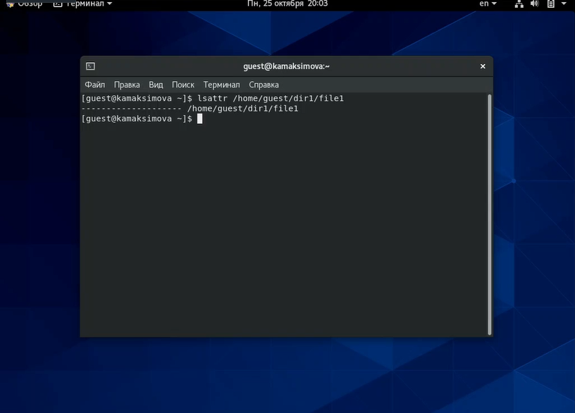{ #fig:001 width=70% }

[Рисунок 1](image/Pic1.png)

Установите командой chmod на файл file1 права, разрешающие чтение и запись для владельца файла

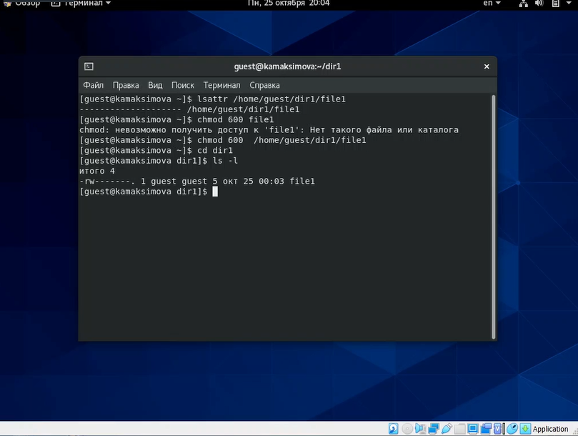{ #fig:002 width=70% }

[Рисунок 2](image/2.png)

Попробуйте установить на файл file1 расширенный атрибут a от имени пользователя guest
В выполнении данной команды было отказано, так как на это у пользователя guest не достаточно прав

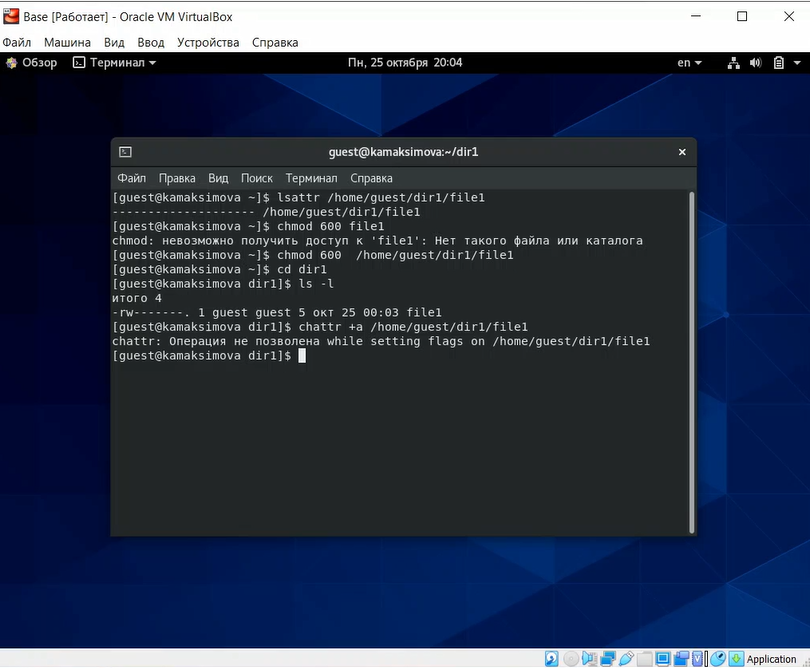{ #fig:003 width=70% }

[Рисунок 3](image/3.png)

Попробуйте установить расширенный атрибут a на файл file1 от имени суперпользователя. Я устанавливала от имени пользователя kamaksimova

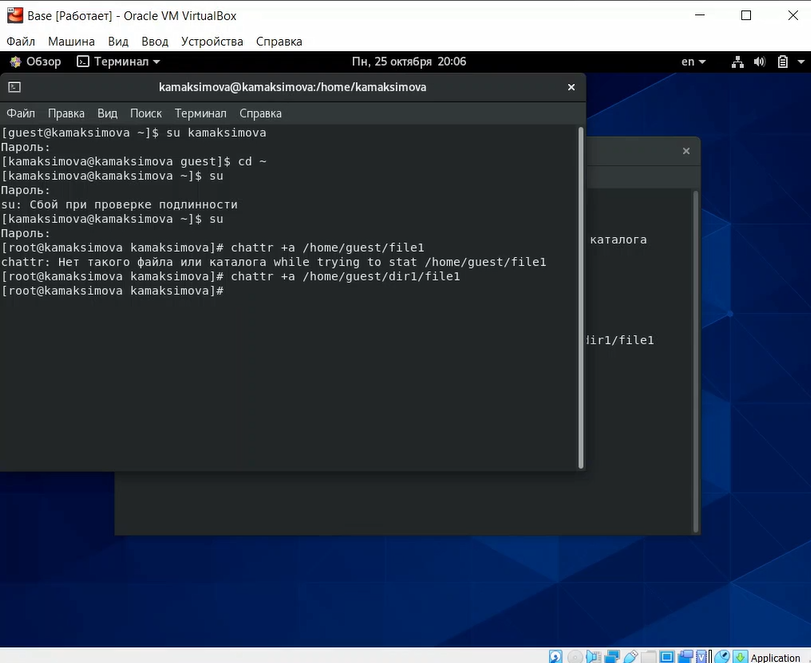{ #fig:004 width=70% }

[Рисунок 4](image/4.png)
 
От имени пользователя guest проверьте правильность установления атрибута
Атрибут установился верно 

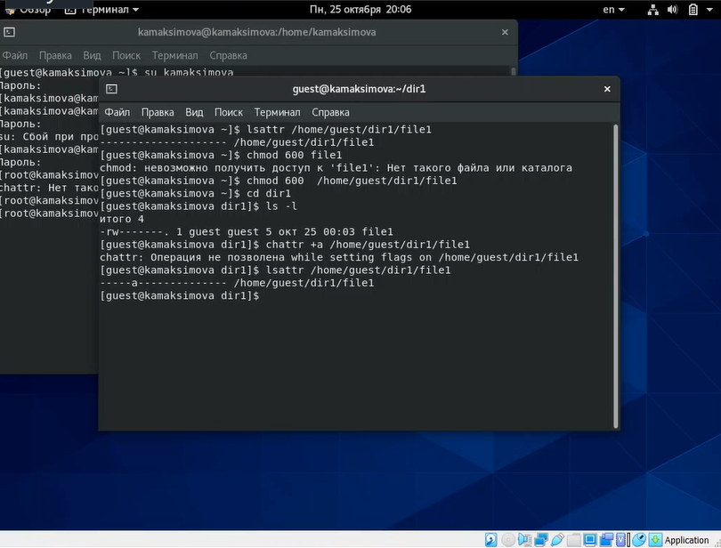{ #fig:005 width=70% }

[Рисунок 5](image/5.png)

Выполните дозапись в файл file1 слова «test» командой echo. После этого выполните чтение файла file1 командой cat.
Слово успешно записалось

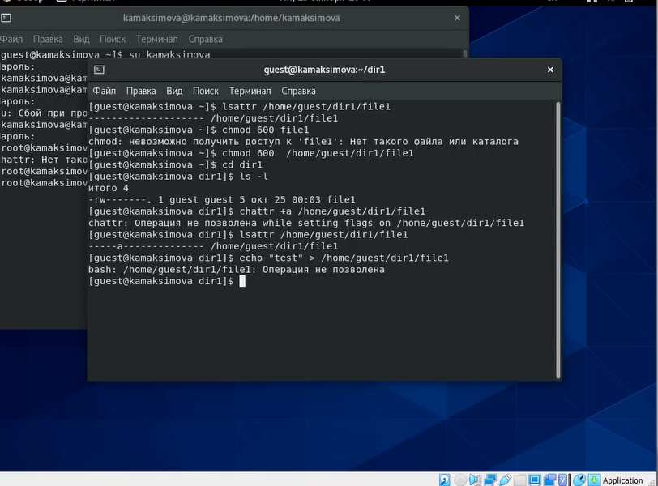{ #fig:006 width=70% }

[Рисунок 6](image/6.png)

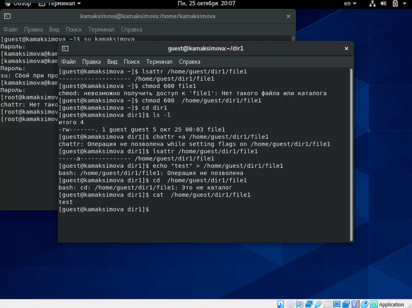{ #fig:007 width=70% }

[Рисунок 7](image/7.png)

Попробуйте удалить файл file1 либо стереть имеющуюся в нём информацию.
В доступе отказано

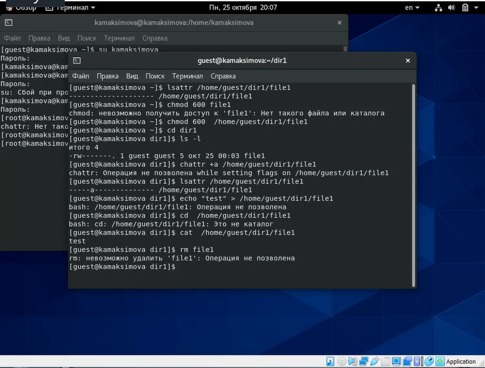{ #fig:008 width=70% }

[Рисунок 8](image/8.png)

Попробуйте с помощью команды chmod установить на файл file1 права, например, запрещающие чтение и запись для владельца файла
В доступе отказано

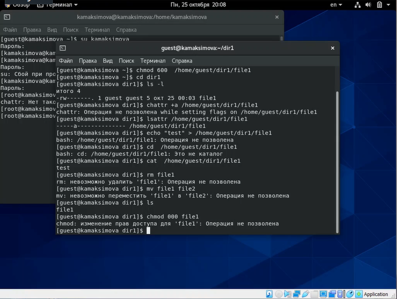{ #fig:009 width=70% }

[Рисунок 9](image/9.png)

Снимите расширенный атрибут a с файла file1 от имени суперпользователя 

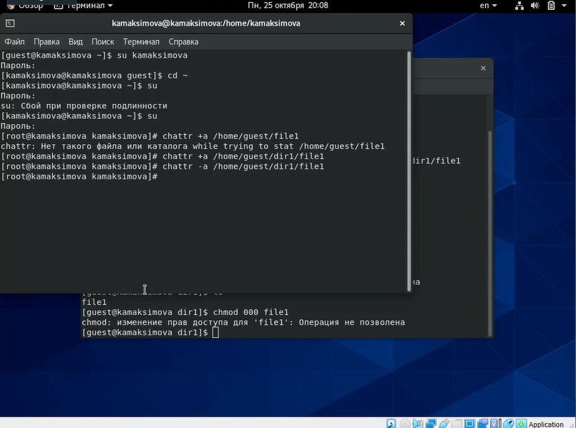{ #fig:010 width=70% }

[Рисунок 10](image/10.png)

Повторите операции, которые вам ранее не удавалось выполнить

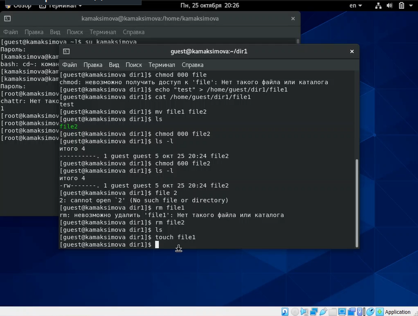{ #fig:011 width=70% }

[Рисунок 11](image/11.png)

Устанавливаем на файл file1 расширенный атрибут i

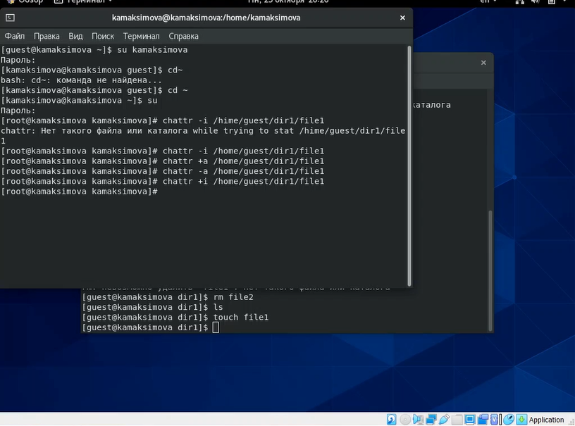{ #fig:012 width=70% }

[Рисунок 12](image/12.png)

Пробуем дозаписать информацию в файл, прочитать файл, удалить его и поменять атрибуты

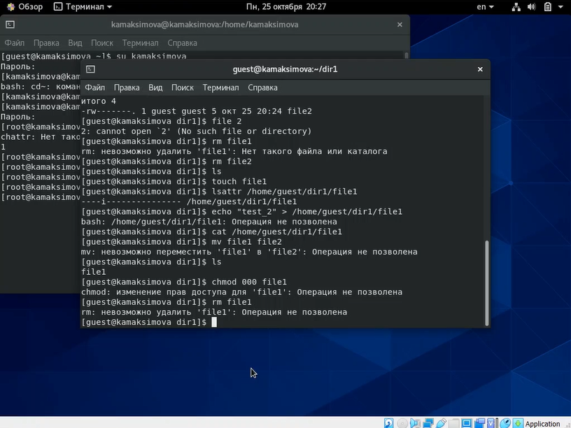{ #fig:013 width=70% }

[Рисунок 13](image/13.png)

# Выводы

В результате выполнения работы мы повысили свои навыки использования интерфейса командой строки (CLI), познакомились на примерах с тем,
как используются основные и расширенные атрибуты при разграничении
доступа. Имели возможность связать теорию дискреционного разделения
доступа (дискреционная политика безопасности) с её реализацией на практике в ОС Linux. 
Опробовали действие на практике расширенных атрибутов «а» и «i».

# Список литературы{.unnumbered}
[1. Права доступа к файлам в Linux](https://losst.ru/prava-dostupa-k-fajlam-v-linux)

[2. Файловые атрибуты](https://zalinux.ru/?p=6440)

[3. Команда Chattr в Linux](https://routerus.com/chattr-command-in-linux/)

::: {#refs}
:::
