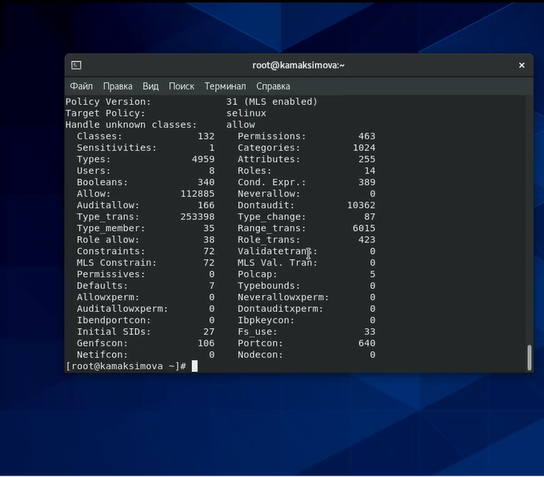

---
# Front matter
title: "Отчёт по лабораторной работе 6"
subtitle: "Мандатное разграничение прав в Linux"
author: "Максимова Ксения НБИбд-02-18"

# Generic otions
lang: ru-RU
toc-title: "Содержание"

# Bibliography
bibliography: bib/cite.bib
csl: pandoc/csl/gost-r-7-0-5-2008-numeric.csl

# Pdf output format
toc: true # Table of contents
toc_depth: 2
lof: true # List of figures
fontsize: 12pt
linestretch: 1.5
papersize: a4
documentclass: scrreprt
## I18n
polyglossia-lang:
  name: russian
  options:
	- spelling=modern
	- babelshorthands=true
polyglossia-otherlangs:
  name: english
### Fonts
mainfont: PT Serif
romanfont: PT Serif
sansfont: PT Sans
monofont: PT Mono
mainfontoptions: Ligatures=TeX
romanfontoptions: Ligatures=TeX
sansfontoptions: Ligatures=TeX,Scale=MatchLowercase
monofontoptions: Scale=MatchLowercase,Scale=0.9
## Biblatex
biblatex: true
biblio-style: "gost-numeric"
biblatexoptions:
  - parentracker=true
  - backend=biber
  - hyperref=auto
  - language=auto
  - autolang=other*
  - citestyle=gost-numeric
## Misc options
indent: true
header-includes:
  - \linepenalty=10 # the penalty added to the badness of each line within a paragraph (no associated penalty node) Increasing the value makes tex try to have fewer lines in the paragraph.
  - \interlinepenalty=0 # value of the penalty (node) added after each line of a paragraph.
  - \hyphenpenalty=50 # the penalty for line breaking at an automatically inserted hyphen
  - \exhyphenpenalty=50 # the penalty for line breaking at an explicit hyphen
  - \binoppenalty=700 # the penalty for breaking a line at a binary operator
  - \relpenalty=500 # the penalty for breaking a line at a relation
  - \clubpenalty=150 # extra penalty for breaking after first line of a paragraph
  - \widowpenalty=150 # extra penalty for breaking before last line of a paragraph
  - \displaywidowpenalty=50 # extra penalty for breaking before last line before a display math
  - \brokenpenalty=100 # extra penalty for page breaking after a hyphenated line
  - \predisplaypenalty=10000 # penalty for breaking before a display
  - \postdisplaypenalty=0 # penalty for breaking after a display
  - \floatingpenalty = 20000 # penalty for splitting an insertion (can only be split footnote in standard LaTeX)
  - \raggedbottom # or \flushbottom
  - \usepackage{float} # keep figures where there are in the text
  - \floatplacement{figure}{H} # keep figures where there are in the text
---

# Цель работы

Развить навыки администрирования ОС Linux. Получить первое практическое знакомство с технологией SELinux.
Проверить работу SELinx на практике совместно с веб-сервером Apache.

# Задание

Установить веб-сервер Apache и проверить на нем работу SELinx.

# Теоретическое введение

SELinux (Security-Enhanced Linux) — реализация системы принудительного контроля доступа, 
которая может работать параллельно с классической избирательной системой контроля доступа[[1]](https://ru.wikipedia.org/wiki/SELinux).
В SELinux права доступа определяются самой системой при помощи специально определенных политик. 
Политики работают на уровне системных вызовов и применяются самим ядром (но можно реализовать и на уровне приложения). 
SELinux действует после классической модели безопасности Linux. 
Иными словами, через SELinux нельзя разрешить то, что запрещено через права доступа пользователей или групп. 
Политики описываются при помощи специального гибкого языка описания правил доступа[[1]](https://ru.wikipedia.org/wiki/SELinux).

Основные понятия [[1]](https://ru.wikipedia.org/wiki/SELinux)

1. Домен — это некоторый набор действий, которые может производить один процесс. Главным образом это действия, необходимые процессу для выполнения определенной задачи.
2. Роль — это совокупность нескольких доменов.
3. Контекст безопасности — это совокупность всех атрибутов, которые связаны с объектами и субъектами.
4. Политика безопасности — это набор заданных правил, который регулирует взаимодействие ролей, доменов.

Security Enhanced Linux может работать различными способами[[2]](https://itsecforu.ru/2019/07/25/%F0%9F%9B%A1%EF%B8%8F-%D1%80%D0%B5%D0%B0%D0%BB%D0%B8%D0%B7%D0%B0%D1%86%D0%B8%D1%8F-%D0%BC%D0%B0%D0%BD%D0%B4%D0%B0%D1%82%D0%BD%D0%BE%D0%B3%D0%BE-%D0%BA%D0%BE%D0%BD%D1%82%D1%80%D0%BE%D0%BB%D1%8F-%D0%B4/):

- Enforcing: SELinux запрещает доступ на основе правил политики SELinux, набора руководящих принципов, которые управляют механизмом безопасности.
- Permissive: SELinux не запрещает доступ, но в журнале регистрируются отказы для действий, которые были бы запрещены при запуске в принудительном режиме.
- Disabled: Полное отключение системы принудительного контроля доступа

SELinux предоставляет следующие модели управления доступом[[3]](https://habr.com/ru/company/kingservers/blog/209644/):

1. Type Enforcement (TE): основной механизм контроля доступа, используемый в целевых политиках. 
Позволяет детально, на самом низком уровне управлять разрешениями. 
Самый гибкий, но и самый трудоемкий для системного администратора механизм.

2. Role-Based Access Control (RBAC): в этой модели права доступа реализуются в качестве ролей. 
Ролью называется разрешения на выполнение определенных действий одним или несколькими элементами системы над другими частями системы. 
По-сути, RBAC является дальнейшим развитием TE.

3. Multi-Level Security (MLS): многоуровневая модель безопасности, 
в которой всем объектам системы присваивается определенный уровень доступа. 
Разрешение или запрет доступа определяется только соотношением этих уровней.

# Выполнение лабораторной работы

1. Убедитесь, что SELinux работает в режиме enforcing политики targeted.

{ #fig:001 width=70% }

[Рисунок 1](image/1.png)

2. Обратитесь с помощью браузера к веб-серверу, запущенному на вашем
компьютере, и убедитесь, что последний работает.

{ #fig:002 width=70% }

[Рисунок 2](image/2.png)

3. Найдите веб-сервер Apache в списке процессов, определите его контекст безопасности.

{ #fig:003 width=70% }

[Рисунок 3](image/3.png)

4. Посмотрите текущее состояние переключателей SELinux для Apache 

{ #fig:004 width=70% }

[Рисунок 4](image/4.png)

Многие из них находятся в положении «off».

5. Посмотрите статистику по политике с помощью команды seinfo, также определите множество пользователей, ролей, типов.

{ #fig:005 width=70% }

[Рисунок 5](image/5.png)

6. Определите тип файлов и поддиректорий, находящихся в директории "/var/www".

{ #fig:006 width=70% }

[Рисунок 6](image/6.png)

7. Определите тип файлов, находящихся в директории "/var/www/html"

{ #fig:007 width=70% }

[Рисунок 7](image/7.png)

8. Определите круг пользователей, которым разрешено создание файлов в директории "/var/www/html"

{ #fig:008 width=70% }

[Рисунок 7](image/7.png)

9. Создайте от имени суперпользователя html-файл

{ #fig:009 width=70% }

[Рисунок 8](image/8.png)

10. Проверьте контекст созданного вами файла. 

{ #fig:010 width=70% }

[Рисунок 8](image/8.png)

11. Обратитесь к файлу через веб-сервер, введя в браузере адрес "http://127.0.0.1/test.html" 

{ #fig:011 width=70% }

[Рисунок 9](image/9.png)

12. Изучите справку man httpd_selinux и выясните, какие контексты файлов определены для httpd. 

{ #fig:012 width=70% }

[Рисунок 10](image/10.png)

13. Измените контекст файла "/var/www/html/test.html с httpd_sys_content_t на любой другой, к которому процесс httpd не
должен иметь доступа, например, на samba_share_t

{ #fig:013 width=70% }

[Рисунок 11](image/11.png)

14. Попробуйте ещё раз получить доступ к файлу через веб-сервер.

{ #fig:014 width=70% }

[Рисунок 12](image/12.png)

15. Проанализируйте ситуацию. Почему файл не был отображён, если права доступа позволяют читать этот файл любому пользователю?

# Выводы

Получены практические навыки администрирования ОС Linux, 
а так же получено практическое знакомство с технологией SELinux совместно с веб-сервером Apache.

# Список литературы{.unnumbered}

[1. SELinux](https://ru.wikipedia.org/wiki/SELinux)

[2. Реализация мандатного контроля доступа с помощью SELinux или AppArmor в Linux](https://itsecforu.ru/2019/07/25/%F0%9F%9B%A1%EF%B8%8F-%D1%80%D0%B5%D0%B0%D0%BB%D0%B8%D0%B7%D0%B0%D1%86%D0%B8%D1%8F-%D0%BC%D0%B0%D0%BD%D0%B4%D0%B0%D1%82%D0%BD%D0%BE%D0%B3%D0%BE-%D0%BA%D0%BE%D0%BD%D1%82%D1%80%D0%BE%D0%BB%D1%8F-%D0%B4/)

[3. SELinux – описание и особенности работы с системой](https://habr.com/ru/company/kingservers/blog/209644/)

::: {#refs}
:::
